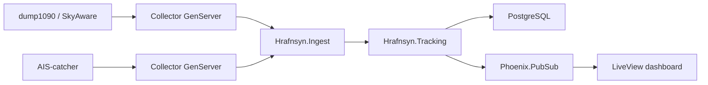

# Architecture

## Overview

Hrafnsyn is a merged tracking surface for aircraft and vessels. The runtime is intentionally split into three layers:

1. source collection
2. normalized ingest and persistence
3. realtime presentation

## Source Integration

As inspected on `2026-04-07`, the initial upstream contracts are:

- aircraft: `GET /data/aircraft.json`
- vessel list: `GET /api/ships_array.json`

The current worker adapters normalize those payloads into a canonical observation shape before persistence.

## Collector Model

Each configured source becomes one long-lived GenServer:

- no job queue latency for hot realtime feeds
- isolated retry/restart behavior per source
- easy fan-out to many plane feeds and many vessel feeds
- explicit source identity for audit history

This keeps collector state simple and makes future transports easy to add. A gRPC stream handler can call the same ingest boundary as the HTTP collectors.

## Merge Strategy

The merge rules are:

- `tracks` stores the latest merged state for a vehicle
- uniqueness is `(vehicle_type, identity)`
- `track_points` stores the time-series log
- uniqueness is `(track_id, source_id, observed_at)`

That means:

- two vessel feeds reporting the same MMSI merge into one live track
- the latest observation updates the header shown in the UI
- every source still leaves its own point history behind

This is the piece that enables route playback for vessels even when the upstream UI does not expose it.

## Search

Search is backed by a denormalized `search_text` field on `tracks` plus `pg_trgm`. The current search index includes:

- identity
- display name
- callsign
- registration / IMO
- destination
- country

## Frontend

The UI stack is:

- Phoenix LiveView for server-rendered state
- Phoenix PubSub for push-driven updates
- MapLibre GL JS for vector map rendering
- OpenFreeMap Liberty style as the default free/open base map

The dashboard is built as:

- large map + status overlays on desktop
- stacked panels on mobile
- track list + detail/log panel beside or below the map depending on width

## Auth Model

Auth is intentionally lightweight:

- anonymous readonly mode can stay enabled
- admins create users
- non-admin users remain readonly

This keeps public display use-cases simple while still allowing controlled access for ops users later.

## Future gRPC Shape

`proto/hrafnsyn/v1/tracking.proto` is included now as a planning contract for future bidirectional ingest. The code path is expected to be:

- gRPC stream handler receives observation envelopes
- handler calls `Hrafnsyn.Ingest.ingest_batch/2`
- tracking persistence and LiveView fan-out stay unchanged

That keeps the transport replaceable without rewriting the domain layer.
